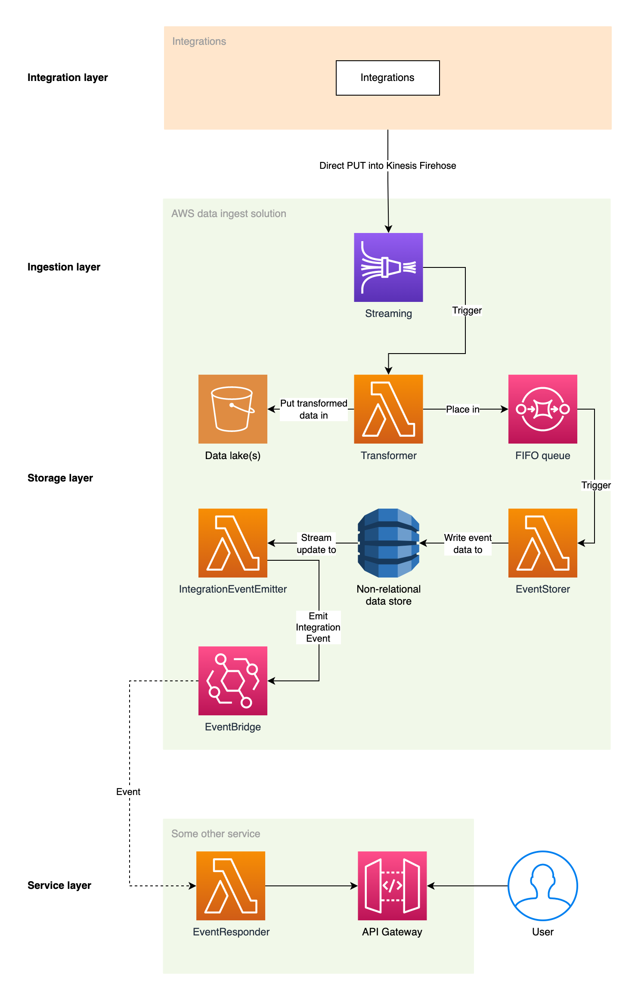

# Example AWS Architecture: Streaming data to events

This repo contains a complete, working architecture on AWS that will take in streaming data, store it in S3 and DynamoDB, and then emit events with their contents.

The example intends to be a valid and truthful, yet not completely minimal, example of this pattern. The state of this work is "solid", but can (and should!) be improved and adapted for the actual needs you might have. Please see the `Improvements and TODO` sections for concise ideas and open suggestions.

**Please note that with the trivial database structure in use, your might get database records that get overwritten if they are written at the the same epoch time**. You can fix this by updating to a more resilient table format, for example by using a range key too.

## How it is structured

The repo consists of three separate services (or stacks, if you will):

1. `ingest`: The main solution that handles intake of data and output of events.
2. `consumer`: A basic demo application that can be triggered by incoming events of a given type, as well as via a regular API Gateway.
3. `generator`: A utility application to generate test data and send it to the ingest solution, either using Kinesis Firehose or SQS.

_This README contains the general project information. Please refer to the READMEs of the various services for more details on any specifics of the above._

## How it works

- **Ingest context**
  - Take in streaming data via [Kinesis Firehose](https://aws.amazon.com/kinesis/data-firehose/) (using "direct PUT events")
  - Transform the data with [Lambda](https://aws.amazon.com/lambda/) (`Transformer` function)
  - Automatically dump the transformed data into an [S3](https://aws.amazon.com/s3/) bucket ("data lake")
  - Place the transformed data into a first-in-first-out [SQS](https://aws.amazon.com/sqs/) queue
  - The queue will trigger a Lambda (`EventStorer` function) that will store the data in [DynamoDB](https://aws.amazon.com/dynamodb/), similar to an event store
  - DynamoDB has the [Streams](https://aws.amazon.com/blogs/database/dynamodb-streams-use-cases-and-design-patterns/) feature turned on, which will trigger a third Lambda (`IntegrationEventEmitter` function) on any database changes
  - The integration event is emitted through [EventBridge](https://aws.amazon.com/eventbridge/) on a custom event bus
- **Consumer context**
  - A basic "consumer" service using Lambda (`EventResponder` function) will be triggered by the integration event
  - [API Gateway](https://aws.amazon.com/api-gateway/) is also deployed in front of the service, so users can access the function/service

## Properties of the solution

- Well-known, high-scaling components
- Mix of eventual (DynamoDB, Lambda) and strong consistency (Kinesis Firehose, FIFO queue)
- Input constraint is equal to the [limits on Kinesis Firehose](https://docs.aws.amazon.com/firehose/latest/dev/limits.html)
- Output constraint is equal to the [limits on EventBridge](https://docs.aws.amazon.com/eventbridge/latest/userguide/eb-quota.html)

## Tooling

This project uses:

- [Terraform](https://www.terraform.io) to describe (and be able to deploy) the infrastructure as code
- [Serverless Framework](https://www.serverless.com) to describe (and be able to deploy) the application parts and services as code
- [TypeScript](https://www.typescriptlang.org) to write most of the application code
- (Optional) [Checkov](https://www.checkov.io) annotations can be seen in the Terraform modules; not strictly required

## Diagram

See the below diagram for how the overall flow moves through the various AWS components.

---

## Prerequisites

- Amazon Web Services (AWS) account with sufficient permissions so that you can deploy infrastructure. A naive but simple policy would be full rights for at least CloudWatch, Lambda, API Gateway, DynamoDB, X-Ray, SQS, Kinesis, EventBridge, and S3.
- Recent Node version installed, ideally version 16 or later.
- Terraform installed.
- Ideally Terraform Cloud (local or remote workspace). If you're not using Terraform Cloud, remove the `cloud` block from `ingest/infra/main.tf`.

## Configuration

**Before making any changes to names and such, please do a "find-all" in the repo to find references to any values you might want to change.** Search especially for `123412341234` and replace it with your AWS account number.

You should take a look at the Terraform modules (under `ingest/infra/`) and see that any settings, values, and regions are correct and/or optimized for your needs.

Also, if you're not using Terraform Cloud, remove the `cloud` block from `ingest/infra/main.tf`.

## Deployment order

- Deploy `ingest`
- Deploy the Terraform infrastructure in `ingest/infra`
- Deploy `consumer`
- Run `generator`

## Improvements and TODO

- The use of Base64/ASCII/UTF8 conversions across the events/functions can likely be improved a lot
- `generator/index.js` - The current way of turning data into an ArrayBuffer results in garbled data.
- `ingest/infra/modules/kinesis/main.tf` - Customer-managed KMS?
- `ingest/infra/modules/s3/main.tf` - Multi-region replication? TTL, S3 Glacier?
- `ingest/infra/modules/sqs/main.tf` - Add DLQ (Dead Letter Queue)?
- `ingest/infra/modules/dynamodb/main.tf` - Replicas (Global Tables) seem to create problems? (currently turned off)
- `ingest/src/Transformer/adapters/web/Transformer.ts` - Ensure Kinesis config adds newline separators; see https://aws.amazon.com/blogs/big-data/build-seamless-data-streaming-pipelines-with-amazon-kinesis-data-streams-and-amazon-kinesis-data-firehose-for-amazon-dynamodb-tables/
- `ingest/src/EventStorer/adapters/web/EventStorer.ts`: Might be faster to run `const dynamo = createNewDynamoRepository()` in global scope?
- Tests?
- Take incoming events and copy/store them as test data
- DynamoDB: `key` field should have something else inserted into it?
- DynamoDB: Use range key for timestamp?
- EventBridge: Use "Resources" field?
- EventBridge: Emit more events or for more details ("systems")?

## References

- https://aws.amazon.com/premiumsupport/knowledge-center/lambda-s3-cross-account-function-invoke/
- https://stackoverflow.com/questions/42448960/cross-account-lambda-trigger-by-kinesis
- https://docs.aws.amazon.com/amazondynamodb/latest/developerguide/Streams.Lambda.html
- https://aws.amazon.com/blogs/aws/new-use-amazon-s3-event-notifications-with-amazon-eventbridge/
