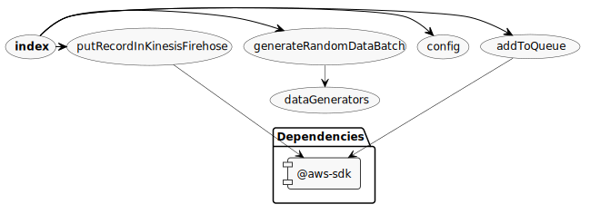

# Test data generator (Example AWS Architecture: Streaming data to events)

Generator service to create test data from a faked integration layer.

## Installation

Run `npm install`.

## Configuration

Since we depend on AWS SDKs, you will need to be authorized through your environment.

Verify that the configuration in `config.js` represents how your setup looks like.

In `index.js` you can run either `generateTestData('kinesis')` or `generateTestData('sqs)` depending on which service you want to put the data in.

## Commands

- `npm start`: Starts the generator service, ending after having being called the configured number of times.

## Diagram

