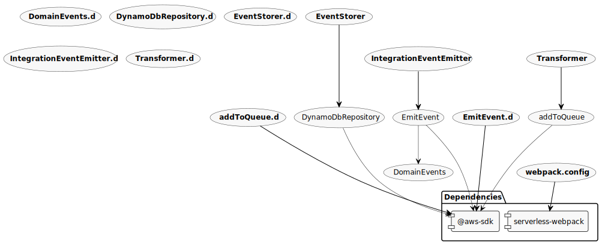

# Ingest solution (Example AWS Architecture: Streaming data to events)

This solution handles the actual intake of data and output of events.

## Installation

Run `npm install`.

## Configuration

Before deploying, you will need to change the AWS account number value in `serverless.yml` under `custom.aws.awsAccountId`.

## Commands

- `npm start`: Runs Serverless Framework in offline mode
- `npm run deploy`: Deploys code with Serverless Framework
- `npm run remove`: Removes code and infrastructure deployed with Serverless Framework
- `npm run build`: Package and build the code with Serverless Framework

## Diagram

